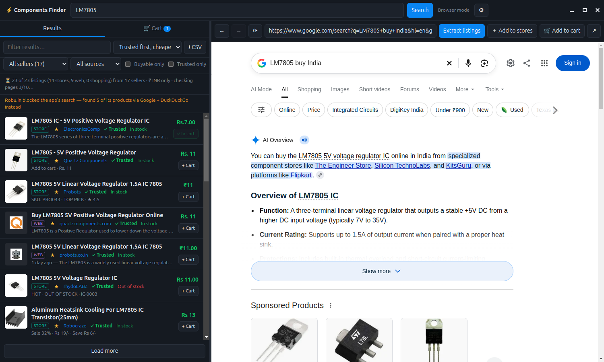
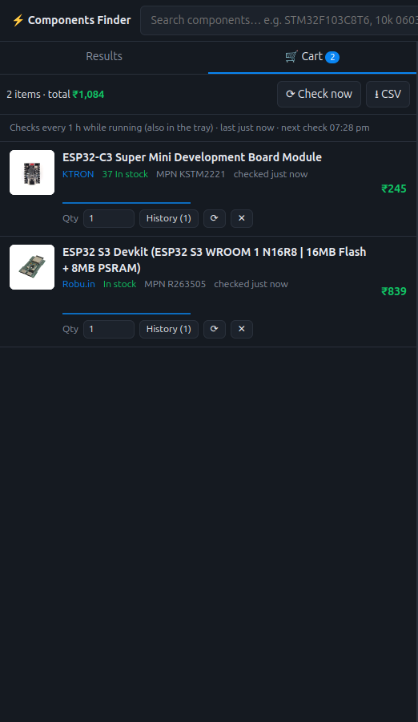

# ⚡ Components Finder

[](https://github.com/stimexpabs/components-finder/actions/workflows/ci.yml)
[](https://github.com/stimexpabs/components-finder/releases/latest)
[](LICENSE)

**Find where to buy an electronic component in India — in one search.**

Type a part number (`ESP32-S3`, `LM7805`, `10k 0603 resistor`) and Components Finder searches
19 Indian component stores, Google and Google Shopping at the same time. It opens each listing to
read its **price in ₹**, **stock** and **part number**, then shows everything in one list you can
sort by trusted seller and price. Put what you want in the **cart** and the app re-checks price
and stock **every hour**, notifying you when something drops in price or comes back in stock.



- **19 stores built in:** Robu, Evelta, KTRON, Sunrom, Campus Component, Robocraze, Semikart,
  ElectronicsComp, Robokits, rhydoLABZ, Think Robotics, FactoryForward, Probots, Quartz Components,
  Hubtronics, Robomart, Thingbits, FlyRobo, Zbotic — add any other shop in one click.
- **Plus Google and Google Shopping**, to find sellers you didn't know about.
- **Real prices and stock**, read from each product page, in **₹ only** (optional).
- **Trusted sellers first, cheapest first** sorting, filters, CSV export.
- **Cart with hourly tracking**, price history and desktop notifications.
- **A built-in browser** next to the results, to open any listing without leaving the app.
- **No account or API key needed.** Free and open source (MIT).

> Linux (AppImage) is the supported platform. It runs from source on Windows and macOS too, but
> those builds aren't published or tested.

---

## Contents

1. [Install](#1-install)
2. [Your first search](#2-your-first-search)
3. [Reading the results](#3-reading-the-results)
4. [Sorting, filtering and trusted sellers](#4-sorting-filtering-and-trusted-sellers)
5. [The built-in browser](#5-the-built-in-browser)
6. [The cart: tracking price and stock](#6-the-cart-tracking-price-and-stock)
7. [Running in the background: tray and start at login](#7-running-in-the-background-tray-and-start-at-login)
8. [Managing your stores](#8-managing-your-stores)
9. [Google CAPTCHAs and blocked stores](#9-google-captchas-and-blocked-stores)
10. [Settings reference](#10-settings-reference)
11. [Optional: SerpAPI](#11-optional-serpapi)
12. [Where your data is stored](#12-where-your-data-is-stored)
13. [Troubleshooting](#13-troubleshooting)
14. [How it works](#14-how-it-works)
15. [Development](#15-development)
16. [Responsible use](#16-responsible-use)
17. [License](#17-license)

---

## 1. Install

### Option A: AppImage (recommended, Linux)

An AppImage is a single file that runs on most Linux distributions without installing anything.

1. **Download** `ComponentsFinder-<version>-x86_64.AppImage` from the
   [latest release](https://github.com/stimexpabs/components-finder/releases/latest).
2. **Make it executable.** In your file manager: right-click → *Properties* → *Permissions* → tick
   *Allow executing file as program*. Or in a terminal:

   ```bash
   chmod +x ComponentsFinder-*-x86_64.AppImage
   ```

3. **Run it** by double-clicking, or:

   ```bash
   ./ComponentsFinder-*-x86_64.AppImage
   ```

   If nothing happens, see [AppImage won't start](#appimage-wont-start) — usually a missing
   `libfuse2` package.

#### Add it to your application menu (optional)

The AppImage works as-is, but this makes it show up in your menu like any installed app. Run these
commands from the folder where you downloaded it:

```bash
# 1. Keep the app in a permanent place
mkdir -p ~/Applications
mv ComponentsFinder-*-x86_64.AppImage ~/Applications/ComponentsFinder.AppImage
chmod +x ~/Applications/ComponentsFinder.AppImage

# 2. Install the icon
mkdir -p ~/.local/share/icons/hicolor/256x256/apps
curl -L -o ~/.local/share/icons/hicolor/256x256/apps/components-finder.png \
  https://raw.githubusercontent.com/stimexpabs/components-finder/main/assets/icon-256.png

# 3. Create the menu entry
cat > ~/.local/share/applications/components-finder.desktop <<EOF
[Desktop Entry]
Type=Application
Name=Components Finder
Comment=Find electronic components to buy in India, compare prices and track them
Exec="$HOME/Applications/ComponentsFinder.AppImage" %U
Icon=components-finder
Terminal=false
Categories=Utility;Electronics;
StartupWMClass=Components Finder
EOF
update-desktop-database ~/.local/share/applications 2>/dev/null || true
```

"Components Finder" now appears in your menu (under *Accessories* / *Utilities*). To update later,
replace `~/Applications/ComponentsFinder.AppImage` with the new version.

### Option B: Run from source (any OS)

You need [Node.js](https://nodejs.org/) 20 or newer and `git`.

```bash
git clone https://github.com/stimexpabs/components-finder.git
cd components-finder
npm install
npm start
```

`npm install` downloads Electron (about 100 MB) the first time.

### Option C: Build the AppImage yourself

```bash
git clone https://github.com/stimexpabs/components-finder.git
cd components-finder
npm install
npm run dist
```

The AppImage is written to `dist/ComponentsFinder-<version>-x86_64.AppImage`.

---

## 2. Your first search

1. **Type a part** in the search bar at the top. Part numbers work best (`ESP32-S3`, `LM7805`,
   `AMS1117-3.3`), but descriptions work too (`10k 0603 resistor`, `arduino nano`).
2. **Press Enter** (or click **Search**).
3. **Watch the list fill in.** Results arrive in stages:
   - your **stores** first (each store's own search, up to 3 result pages),
   - then **Google** results and **Google Shopping**,
   - then, for Google results, the app **opens each page** to read the real price and stock —
     rows showing *checking…* are being read. The status line shows the progress
     (*checking pages 12/28…*).

   A full search takes about 30–90 seconds, depending on how many stores have the part. You can
   use the list while it's still filling in.
4. **Click any row** to open that product in the browser on the right.

If Google asks for a CAPTCHA, the search pauses and shows it in the browser — see
[Google CAPTCHAs](#9-google-captchas-and-blocked-stores).

---

## 3. Reading the results

Each row shows:

| Part of the row | Meaning |
|---|---|
| **Store** / **Web** / **Shopping** badge | Where it came from: one of your stores' own search, a Google web result, or Google Shopping. |
| **☆ / ★** | Click to trust or untrust this seller (see [trusted sellers](#trusted-sellers)). |
| Seller name | The store, website or Google Shopping merchant. |
| **✓ Trusted** | The seller is on your trusted list. |
| Stock | *In stock*, *Out of stock*, *Backorder*…, with the quantity when the site shows one (e.g. *37 in stock*). |
| **MPN** | The manufacturer / store part number, when the page has one. |
| Price (right) | The listing's price. *checking…* = still being read; *see site* = the page didn't show a price. |
| **+ Cart** | Add to your cart for hourly tracking. Shows *✓ In cart* if it's already there. |

The **status line** above the list sums up the search, e.g.
*135 of 135 listings (70 stores, 22 web, 43 shopping) from 51 sellers · ₹ INR only*.
Below it, a **notes line** can appear — for example when a store blocked the app's search and its
products were found through Google instead (see [section 9](#9-google-captchas-and-blocked-stores)).

**Load more** (bottom of the list) fetches more Google result pages for the same search.

---

## 4. Sorting, filtering and trusted sellers

### Sorting

The sort menu (next to the filter box) offers:

| Sort | Order |
|---|---|
| **Trusted first, cheapest** *(default)* | Your trusted sellers on top, then everyone else. Within each group: cheapest first, in-stock before out-of-stock at the same price, listings without a price last. |
| **Cheapest first** | Plain price order (ties go to trusted sellers). |
| **Most expensive first** | Reverse price order. |
| **Relevance** | The order results arrived in. |
| **Seller** | Alphabetical by seller. |
| **Stock** | Largest known stock first. |

Your choice is remembered next time.

> Prices are compared as listed: a "pack of 10" and a single piece are not compared per unit.
> Check pack sizes when comparing cheap parts.

### Filtering

- **Filter results…** — type to narrow the list (matches title, seller, description and MPN).
- **All sellers** — show one seller only (with counts per seller).
- **All sources** — only your stores, only Google web results, or only Google Shopping.
- **Buyable only** — hide listings with no price and no stock information.
- **Trusted only** — hide sellers that aren't on your trusted list.

### Trusted sellers

The trusted list starts with your 19 stores plus authorised distributors (DigiKey, Mouser,
element14, RS India). To change it:

- **Quick:** click the **☆** next to any seller to trust it, **★** to untrust it.
- **Full list:** ⚙ **Settings → Trusted sellers**, one entry per line:
  - a **domain** like `robu.in` — matches listings on that site (and its subdomains), and Google
    Shopping sellers named like it ("Robu.in", "Quartz Components" for `quartzcomponents.com`);
  - or a **seller name** like `DigiKey` — matches any seller whose name contains it
    ("DigiKey India").
  - Lines starting with `#` are comments.

### Export

**⭳ CSV** saves the currently shown list (with your filters and sort) as a spreadsheet, including
price, stock, MPN, trusted flag and link.

---

## 5. The built-in browser

The right-hand side is a normal web browser (← → ⟳, address bar — type a URL or a search).
It shares its cookies with the app's searches, so logging in or passing a check there also helps
the searches. The toolbar has four extra buttons:

| Button | What it does |
|---|---|
| **Extract listings** | Pulls every product listing from the page you're looking at (a Google results page, Google Shopping, a store's search page) into the results list, where each gets **+ Cart**. |
| **＋ Add to stores** | Adds the site you're on to your stores, so it's searched with every search from now on (see [section 8](#8-managing-your-stores)). If you have a search open, the new store is searched right away. |
| **🛒 Add to cart** | Adds the **product page you're on** to your cart — for things you found by browsing yourself. The app reads the page's name, price, stock, part number and image. On a page listing many products it tells you to open one first (or use *Extract listings*). |
| **↗** | Opens the current page in your normal web browser. |

The **🛒 Add to cart** button turns into **✓ In cart** when the page you're on is already in your cart.

---

## 6. The cart: tracking price and stock



**Add items** with **+ Cart** on any result, or **🛒 Add to cart** on any product page in the
browser. Open the **🛒 Cart** tab (next to *Results*) to see them.

Each cart item shows:

- current **price**, and **▼ / ▲ %** change since tracking began;
- **stock** status and quantity, **MPN**, and when it was last checked;
- a small **price chart**;
- a **Qty** box — how many you need. It's used for the total, and for the
  *"only N left — you need M"* alert;
- **History** — every change with its date and time;
- **⟳** check this item now, **✕** remove it.

At the top: the **total** for everything in the cart, when it was last checked, the next check,
**⟳ Check now** and **⭳ CSV**.

### How tracking works

- **Every hour** (change it in Settings), the app opens each item's page again and reads its price
  and stock.
- The **first check** right after adding sets the starting point (a product page can show a
  different price than a search listing, e.g. with or without GST), so that isn't reported as a
  change.
- You get a **desktop notification** when:
  - the **price drops**,
  - an item **comes back in stock**,
  - an item **sells out**,
  - **fewer are left than your Qty**.

  Clicking a notification opens that item in the cart. Price rises are logged in History but don't
  notify.
- If a check fails (site down, bot check), the last known values are kept and the item shows a ⚠
  note; after 3 failures in a row it's logged in History.
- Checks only run **while the app is running** — see the next section to keep it running in the
  background. If the app was closed for longer than the interval, it catches up about 30 seconds
  after starting.

---

## 7. Running in the background: tray and start at login

**Closing the window doesn't quit the app** — it keeps running in the **system tray** (the ⚡ icon),
so cart tracking continues. The first time, a notification tells you so.

**Right-click the tray icon** for:

- **Open Components Finder**
- the cart total and the next check time
- **Check cart now**
- **Start at login** (tick box)
- **Quit** — the only way to fully close the app.

**Start at login** launches the app into the tray (no window) whenever you log in, so your cart is
always tracked. Turn it on in the tray menu or in Settings. On Linux it creates
`~/.config/autostart/components-finder.desktop`, pointing at the AppImage's current location — if
you move the AppImage, untick and re-tick **Start at login**.

Don't want the tray? Untick **Keep running in the tray** in Settings; closing the window then quits.

Only one copy runs at a time: starting the app again just brings up the open window.

> On GNOME, tray icons need the *AppIndicator and KStatusNotifierItem Support* extension. Cinnamon,
> KDE, XFCE and MATE show them out of the box.

---

## 8. Managing your stores

### Add a shop in one click

1. Open the shop's website in the built-in browser.
2. Click **＋ Add to stores**.

That's it. On every search the app opens the site, finds its search box, types the part number and
presses Enter — like you would — then reads the results. The first time, it remembers the address
that search produced, so later searches go straight to the results page.

### Edit the list by hand

⚙ **Settings → My stores**, one store per line, in either form:

```
DNA Solutions | https://www.dnatechindia.com/
Robu.in | https://robu.in/?s={q}&post_type=product
```

- **`Name | site address`** — the app uses the site's own search box (as above).
- **`Name | search address with {q}`** — the app goes straight to that address, with `{q}` replaced
  by the part number. Use this when the search-box method doesn't work for a site.

**How to find a site's search address:** search for `TEST` on the site, copy the address of the
results page, and replace `TEST` with `{q}`. For example
`https://example.in/search?q=TEST&type=product` → `https://example.in/search?q={q}&type=product`.

To remove a store, delete its line. Untick **Search my stores directly** to switch store searching
off completely.

### How much is read

Each store's results are read up to **3 pages deep** (Settings → *Result pages to read per store*,
1–10). The app follows the store's *next page* links or clicks its *Next* / *Load more* buttons, and
stops early once a page has nothing matching your part. Products whose names don't contain your
part number are dropped — store searches often pad results with unrelated items.

---

## 9. Google CAPTCHAs and blocked stores

### Google CAPTCHAs

Google sometimes asks automated browsers to prove they're human, especially after many searches.
When that happens:

1. The search **pauses**, and the CAPTCHA opens in the built-in browser with a yellow banner:
   *"Google wants a CAPTCHA before it shows results."*
2. **Solve it** there.
3. The search **continues by itself** with Google's results — every part of the search that was
   waiting resumes, so you only solve it once.

Click **Skip** (or wait 3 minutes) to carry on without Google. The app never solves or bypasses
CAPTCHAs itself.

### Stores that block the app

Some stores protect their search with bot checks — for example **Robu.in** (Cloudflare) and
**Semikart**. The app doesn't try to get around those. Instead, when a store's own search blocks it:

1. It looks for that store's product pages on **Google** (e.g. *"esp32 s3 robu.in"*) and
   **DuckDuckGo** (*"site:robu.in esp32 s3"*), and merges them.
2. It opens each product page (those usually aren't blocked) to read the price, stock and name.
3. They're listed under that store, marked *"Found via Google + DuckDuckGo"*, and the notes line
   says so.

This finds the most relevant products (typically 10–20), not every result the store's own search
would show. You can switch it off in Settings (*When a store blocks the app's search…*). If nothing
is found that way, the store is listed as blocked: click it to open the store in the browser.

---

## 10. Settings reference

Open ⚙ (top right). Everything is saved automatically when you click **Save**.

| Setting | Default | What it does |
|---|---|---|
| **Search source** | Built-in browser | *Built-in browser* (free, no key) or *SerpAPI* (see [section 11](#11-optional-serpapi)). |
| **SerpAPI key** | — | Only for the SerpAPI source. |
| **INR only** | On | Searches Google as India and keeps only listings priced in ₹. A listing without a price is kept only if the site ends in `.in` or is one of your stores. |
| **Search my stores directly** | On | Search the stores in *My stores* on every search. |
| **My stores** | 19 Indian stores | See [section 8](#8-managing-your-stores). |
| **Trusted sellers** | Your stores + DigiKey, Mouser, element14, RS India | See [trusted sellers](#trusted-sellers). |
| **When a store blocks the app's search, find its products via DuckDuckGo / Google** | On | See [section 9](#9-google-captchas-and-blocked-stores). |
| **Result pages to read per store** | 3 | 1–10. More pages = more results, slower searches. |
| **Check cart items every (minutes)** | 60 | 5–1440. |
| **Keep running in the tray when the window is closed** | On | See [section 7](#7-running-in-the-background-tray-and-start-at-login). |
| **Start at login (in the tray)** | Off | See [section 7](#7-running-in-the-background-tray-and-start-at-login). |
| **Country (gl, when INR only is off)** | `in` | Google country code used when *INR only* is off. |
| **Extra words for the web search** | `buy` | Added to the Google search so shop pages rank above datasheets. Leave empty for the plain part number. |
| **Google result pages per search** | 3 | Google pages read per search (about 10 results each). |
| **Listing pages to open for price / stock** | 40 | How many Google results are opened to read their real price and stock. |
| **Also include Google Shopping results** | On | Merge Google Shopping into the results. |

---

## 11. Optional: SerpAPI

By default the app reads Google itself, which is free but can run into CAPTCHAs. **SerpAPI** is a
paid service that runs Google searches for you and returns the results directly — no CAPTCHAs.

- Free plan: 250 searches/month. Each search in the app uses about 2 (web + Shopping), so roughly
  125 part searches a month. Cart tracking doesn't use SerpAPI.
- Setup: sign up at [serpapi.com](https://serpapi.com), copy your key from
  [the API key page](https://serpapi.com/manage-api-key), then in the app: ⚙ → **Search source:
  SerpAPI** → paste the key → **Save**.
- In SerpAPI mode, one Google page is read per search (use **Load more** for more). Your stores
  are still searched directly either way.

Your key is stored only on your computer (see below).

---

## 12. Where your data is stored

Everything stays on your computer, in `~/.config/components-finder/` (Linux):

| File | Contents |
|---|---|
| `settings.json` | Your settings, stores and trusted sellers (and SerpAPI key, if set — readable only by your user). |
| `cart.json` | Your cart, with price and stock history. |
| `learned-searches.json` | Search addresses the app learned for stores added by site address. |

The built-in browser's cookies and cache are in the same folder. To start fresh, quit the app and
delete the folder. No data is sent anywhere except the searches and page loads themselves.

---

## 13. Troubleshooting

### AppImage won't start

- **Nothing happens / "dlopen(): error loading libfuse.so.2"**: AppImages need FUSE 2.
  - Ubuntu 24.04+, Linux Mint 22+: `sudo apt install libfuse2t64`
  - Ubuntu 22.04, Debian: `sudo apt install libfuse2`
  - Fedora: `sudo dnf install fuse fuse-libs`
- **"Permission denied"**: make it executable (`chmod +x ComponentsFinder-*.AppImage`).
- **Sandbox error mentioning `chrome-sandbox`** (some distributions restrict unprivileged user
  namespaces): run it once from a terminal to see the message; as a workaround you can start it
  with `--no-sandbox`, which turns off Chromium's sandbox — only do this if you understand the
  trade-off.

### Google results are missing

- The notes line says *"Google's CAPTCHA wasn't solved"*: search again and solve the CAPTCHA when
  it appears (see [section 9](#9-google-captchas-and-blocked-stores)).
- Heavy use in a short time makes Google ask more often. Consider [SerpAPI](#11-optional-serpapi).

### A store shows no results

- It may simply not stock the part — open the store in the browser and search there to check.
- It may be listed as **blocked** in the notes line — see [section 9](#9-google-captchas-and-blocked-stores).
- For a store added by site address, the search box may not have been found: add it with a search
  address (`{q}`) instead — see [section 8](#8-managing-your-stores).

### A price looks wrong

Prices are read automatically from each page, and some shops' pages are unusual. Always check the
price on the store's page (click the row) before buying. If a site is consistently wrong, please
[open an issue](https://github.com/stimexpabs/components-finder/issues) with the product link.

### No tray icon / notifications

- GNOME needs the *AppIndicator* extension for tray icons (see [section 7](#7-running-in-the-background-tray-and-start-at-login)).
- Notifications use your desktop's notification system — check they're not muted for the app.

### Start at login stopped working

You probably moved the AppImage. Open the app, then untick and re-tick **Start at login**.

---

## 14. How it works

Components Finder is an [Electron](https://www.electronjs.org/) app — a desktop app built from a
Chromium browser and Node.js.

- **Searching:** for each search, the app loads pages in **hidden browser windows** (up to 6 at
  once) that share the built-in browser's session: each store's search page, Google's results and
  Google Shopping. Small scripts read the product cards from each page.
- **Reading product pages:** prices, stock and part numbers come from the structured data shops
  publish for search engines (schema.org JSON-LD, meta tags, microdata), and from the visible page
  when that's missing.
- **Stores without a known search address:** the app types into the site's search box and presses
  Enter, then remembers the resulting address.
- **Relevance and currency:** results that don't contain your part number are dropped; in INR-only
  mode, non-₹ listings are dropped.
- **Cart:** a timer in the main process re-reads each cart item's page and compares it with the
  last check.

### Project layout

```
src/
  main.js          app window, settings, tray/start-at-login wiring, IPC
  search.js        the search pipeline (stores, Google, Shopping, page checks), streamed to the UI
  crawler.js       hidden-window page loading, store search, pagination, search-engine lookups
  captcha.js       pausing Google requests until the user solves a CAPTCHA
  providers.js     SerpAPI client, price and currency parsing
  stores.js        default stores, search addresses, learning an address from a search
  learned.js       storage for learned search addresses
  filters.js       relevance and INR-only rules
  cart.js          cart storage, timed re-checks, notifications
  tracker.js       what changed between two checks (price, stock, low stock)
  tray.js          tray icon and menu
  autostart.js     start at login (Linux autostart entry; login items on macOS/Windows)
  preload.js       the bridge between the window and the main process
  renderer/        the user interface
    index.html, styles.css, renderer.js
    extractor.js   page-reading scripts (Google results, product grids, product pages)
    trust.js       trusted sellers and the price/trust sort orders
test/              unit tests (node --test)
assets/            app icons
```

---

## 15. Development

```bash
npm install     # install Electron and the build tools
npm start       # run the app from source
npm test        # run the unit tests
npm run dist    # build dist/ComponentsFinder-<version>-x86_64.AppImage
```

Tests run on every push and pull request ([CI](.github/workflows/ci.yml)).

### Making a release

1. Update `version` in `package.json` and commit.
2. `npm run dist`
3. Create a GitHub release for tag `v<version>` and attach the AppImage from `dist/`:

   ```bash
   gh release create v<version> dist/ComponentsFinder-<version>-x86_64.AppImage --generate-notes
   ```

### Contributing

Issues and pull requests are welcome. Especially useful:

- **Stores**: a shop whose results aren't read correctly, or one that should be in the default
  list — include the store's search address.
- **Wrong prices or stock** for a specific product page — include the link.

Please run `npm test` before opening a pull request.

---

## 16. Responsible use

- Components Finder reads **public web pages**, the same pages you'd see in a browser, at a normal
  pace. Use it for personal research, respect each website's terms of service, and don't use it
  for bulk scraping.
- It **doesn't bypass** CAPTCHAs or bot protection. When a site asks for a check, you decide
  whether to complete it yourself.
- Prices and stock are read automatically and **may be wrong or out of date**. Always confirm on
  the seller's site before buying.
- This project isn't affiliated with Google, DuckDuckGo, SerpAPI or any of the stores mentioned.
  Store names are used only to identify them.

---

## 17. License

[MIT](LICENSE) © 2026 Pabitra Majhi
